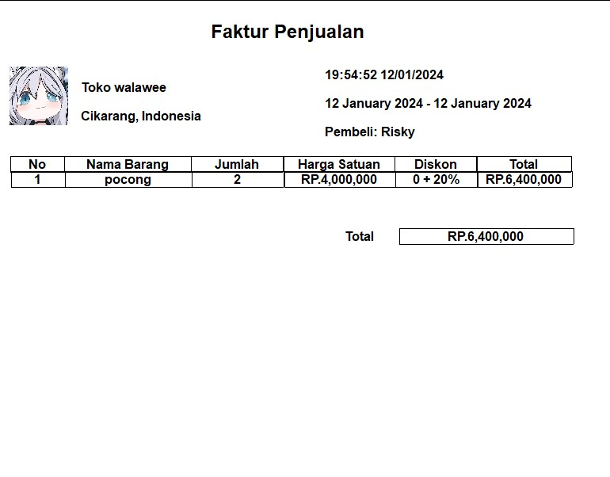

# uaspemrogramanvisual
Berikut adalah demo dari aplikasi ini:

# Tampilan awal
  
# Login
  
# Dashboard
  
# Data Barang
  
# Tambah Barang
  
# Berhasil Tambah Barang
  
# Data Kategori Barang
  
# Tambah Data Kategori
  
# Transaksi Penjualan
  
# Tambah Transaksi Penjualan
  
# Tambah Transaksi 
  
# Tambah Detail Transaksi 
  
# Laporan
  
# Faktur Penjualan 
  